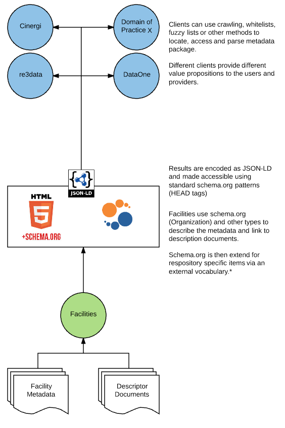

# EarthCube CDF Registry Working Group


## About
The EarthCube Council of Data Facilities (CDF) formed the Registry Working Group to review alignment of existing approaches to research facility description and discovery.  The involved parties include the EarthCube CDF, Coalition for Publishing Data in the Earth and Space Sciences (COPDESS) and the Registry of Research Data Repositories (re3data).   

* [EarthCube CDF](https://www.earthcube.org/group/council-data-facilities)
* [Re3data](http://www.re3data.org/) and  [RE3 schema](http://www.re3data.org/schema) 
* [COPDESS](http://www.copdess.org/)


## Ohter documemts

* [Members](members.md)
* [ESIP Presentation](./doc/ESIPSemCommJune2017/talkBody.md)
* [EarthCube All Hands Poster](./doc/ECAHM_poster.pdf)
* [Harvesting (old)](onHarvesting.md)
* [Implementation (old)](onImplementation.md)


## Files
The following files are being generated to test out various approaches to encoding the facility metadata.  The "C" files are "candidate" or "test" files.  The files with facility names represent examples of using these tests to do an example encoding of a particular facility's data.  

#### Facility examples
* opencore.json : Example of encoding Open Core services into this schema.org
* bcodmo.json : Example for BCO-DMO
* iris.json : Example for IRIS with a mix of machine and human focused resources


#### Candidate encodings :  Some test of various encoding ideas
* registryC5.json : A test of multiple context entries..  to allow us to use
other context for things like controlled voc. 
* registryC4.json : Simple example with some ContactPoint
* registryC3.json : A test to see how use of subOrganization would work for 
groups that scope several projects 
* registryC2.json : Uses the SearchAction object.  Best candidate so far.
* registryC1.json : Early test... used DigitalDocument which is likely not a proper 
use of this type.  However, it might apply to the VoID document in some ways.   
 

## Notes on approaches
The following are a few brief note on how this might all fit together into an example 
implementation.  

#### Simple Scenario 

1. A facility has both metadata about the facility as well as links to service description 
documents like Swagger, OGC or Threads.  
2. These are assembled together into a JSON-LD document following schema.org patterns with possible
use of external vocabularies.  This is then placed into the facility landing page (or other designated page) via 
```
    <script type="application/ld+json">
```
3. Items that can not be defined by schema.org can be then be defined via an external vocabulary
4. The white list of site/URLs is feed through something like [https://github.com/fils/contextBuilder](https://github.com/fils/contextBuilder) or by DateOne tools.  This example code will look for schema.org JSON-LD packages defined in item 2.  More advanced crawling solutions might use tools like: https://github.com/anaskhan96/soup or https://github.com/PuerkitoBio/fetchbot 

After reading in the JSON-LD it could be converted to RDF for a triple store 
or other data store approaches used by a harvesting group.   There is no blessed harvesting or presentation 
site.  Any number of groups or organizations could harvest and provide access to this material. 

The following image gives a brief overview of how facilities might take their descriptor documents and metadata
and expose this material up through a workflow to aggregation and interface clients.  





## Errata 
### On ad hoc implementation 
As noted in item 4 a test crawler, harvester and indexer is being developed at 
[contextBuilder](https://github.com/fils/contextBuilder).  This is a simple (and not 
production ready) application for harvesting from a whitelist and extracting the JSON-LD
package.  The next step will be to convert this JSON-LD to triples and moved into a standard 
triple store.  


### On external vocabularies
registryC5 is testing some external vocabulary uses.  It is valid JSON-LD but 
Google will always through an error since it doesn't see this as a property of some
known schema.org class.  This should be fine and I have tested this, but it is always
a worry with Google that you will not know when how they deal with this case
will be changed.   Their typical response has been, "try and get things you need 
in core schema.org".  

### Some early tests / linting
The following links show results of tests on the opencore.json file.  Note that the 
URL error at the Google tool is related to hosting the file at a domain different than what it referees to.

#### Results from Google Structure Data Testing Tool
[View results](https://search.google.com/structured-data/testing-tool#url=https%3A%2F%2Fraw.githubusercontent.com%2Ffils%2FCDFRegistryWG%2Fmaster%2Fopencore.json)

#### Structured Data Linter
[View results](http://linter.structured-data.org/?url=https:%2F%2Fraw.githubusercontent.com%2Ffils%2FCDFRegistryWG%2Fmaster%2Fopencore.json)

