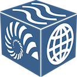

class: center, middle, inverse

# Registry Working Group
## Current status for review

---

## Mission

* Generate a registry of CDF members in collaboration with [RE3Data](http://re3data.org).  
* Evaluate approaches for the facilities to self publish semantic metadata addressing facility 
registration goals. 

## Enabling approaches
* Expose semantic metadata using schema.org as a base vocabulary combined with an (external extensions)[http://schema.org/docs/extension.html] based on RE3 schema 
* Use the web architecture to both publish and consume semantic metadata (HTML5 microdata, standard web arch pub and subscribe, JSON-LD)

---

# Background

#### Contact us
[https://github.com/fils/CDFRegistryWG/blob/master/members.md](https://github.com/fils/CDFRegistryWG/blob/master/members.md)

#### Public reports of group work:
* EarthCube All Hands June 2017 [Poster](https://github.com/fils/CDFRegistryWG/blob/master/docs/ECAHM_poster.pdf)
* ESIP Semantic Committee June 2017 [Presentation](https://github.com/fils/CDFRegistryWG/tree/master/docs/ESIPSemCommJune2017)
* DataONE Members Meeting July 2017 [Poster](https://github.com/fils/CDFRegistryWG/blob/master/docs/DataOneESIP_poster.pdf)
* EarthCube CDF July 2017 Report out at [ESIP Summer 2017](http://www.esipfed.org/meetings/upcoming-meetings/esip-summer-meeting-2017)
* TAC report
* RDA Montreal 

#### Other
Code, docs and other products at:
 * [https://github.com/fils/CDFRegistryWG](https://github.com/fils/CDFRegistryWG) 
 * [https://github.com/fils/contextBuilder](https://github.com/fils/contextBuilder)

---

# Points for consideration

1. vocabulary development
1. ontology publishing
1. external vocabulary approach pattern
1. schema.org publishing guidance 
1. publish and subscribe patterns 
1. extension to other types (connections to P418)

---

# Breakdown (Vocabulary)

* vocabulary development
* ontology publishing
* external vocabulary approach pattern

#### Points
* This functionality will be reached though the use RE3 terms and extend with CDF recommendations.  These will be reviewed by RE3 editorial board for consideration as part of the core RE3 schema.  
* A hosted EarthCube CDF ontology can be done in parallel and designed to support schema.org external extension patterns.
* YAMZ terms

---

# Breakdown (Publish and subscribe)

* schema.org publishing guidance 
* publish and subscribe patterns 

#### Points
* Need a means to address publishing for facility semantic metadata following HTML5 microdata best practices.  Not that to address the core goal of facility metadata a large scale publishing effort is not required by a facility.
* Work to data has provided feedback on the various types and aggregation patterns used by facilities.  Leveraging the general terms found in schema.org combined with specific terms accessible via an external extension has proved a workable approach.  

---

# Breakdown (Forward looking)

* extension to other types (connections to P418)

#### Points
* Application of the approach to types DataCatalog and DataSet have been done and both the publishing and harvesting of these can be done via web architecture patterns.
* ESSO has funded P418 to further address the extension into the Data space not scoped in the RWG efforts
* Discussion has taking place with ESIP regarding work related to types like Person and Event.  Early inspection looks promising and this might be considered by RWG as an in scope topic for basic exploration.  
* Application of hypermedia navigation "hints" via JSON-LD framing are developing.  The approach looks promising and is likely more in scope for P418.
* RWG will be kept in the loop for P418 and provide feedback related to the RWG scoped subjects.

---