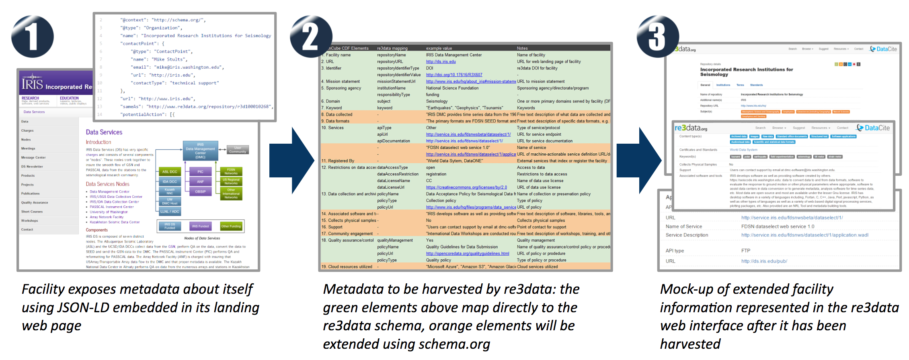
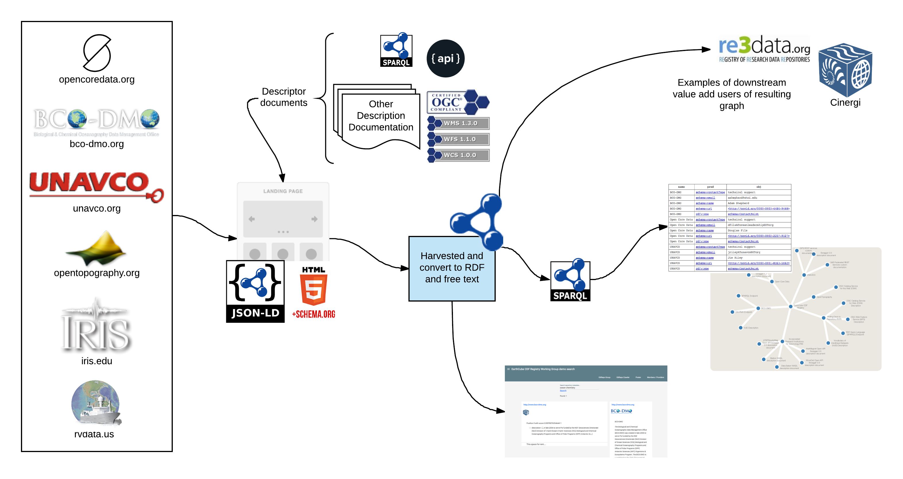
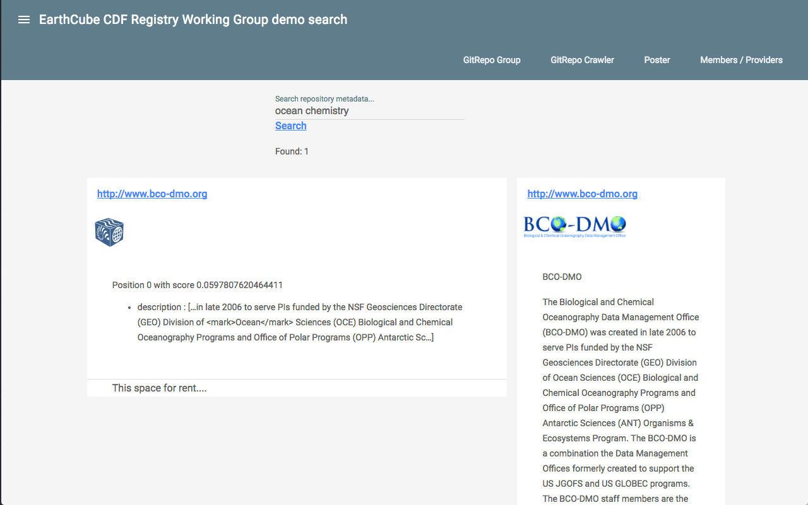

class: center, middle, inverse


# Report on EarthCube CDF Registry Working Group
## Work to Date

.footnote[
  created with [remark](http://github.com/gnab/remark)
]


---

# Group Members


| People          | Institute        | Facility       |
| --------------- | ---------------- | -------------- |
| Time Ahern      | IRIS             | IRIS           |
| Bob Arko        | LDEO / Columbia  | R2R            |
| Doug Fils       | Ocean Leadership | Open Core Data |
| Danie Kinkade   | WHOI             | BCO-DMO        |
| Lynne Schreiber | EarthCube ESSO   | Ucar           |
| Adam Shepherd   | WHOI             | BCO-DMO        |
| Shelley Stall   | AGU              | COPDESS        |
| Mike Stults     | IRIS             | IRIS           |
| Michael Witt    | Purdue           | re3data        |


Acknowledgement:  This work is support by the NSF EarthCube Program and the EarthCube Science Support Office (ESSO) which provides infrastructure and administrative support for the group.   

We are a working group..  NOT a funded project.

Code, docs and other products at:
 * [https://github.com/fils/CDFRegistryWG](https://github.com/fils/CDFRegistryWG) 
 * [https://github.com/fils/contextBuilder](https://github.com/fils/contextBuilder)


---

# Objectives and Benefits

#### Objectives
1. Formalize a set of repository parameters-of-interest to CDF members.
1. Review the alignment of those parameters with re3data and COPDESS.
1. Demonstrate a web platform based approach to encode this information in a machine readable format.
1. Demonstrate strategies for CDF members to express/expose this information via the web
1. Demonstrate the use of schema.org patterns for publishing and accessing this metadata.
1. Leverage re3data as a reference implementation for collecting and utilizing this metadata.

#### Benefits
* Repositories have control over their metadata and can maintain one copy for multiple users.
* Web platform / architecture based leveraging existing strong standards guidance and governance 
* A base common vocabulary with domain or community extensibility 

---
# Objectives and Benefits 


#### Current work flow

* Encode in JSON-LD (schema.org/Organization and re3data vocabularies (mostly))
* Encode basic facility / repository metadata and links to service description documents (OGC, Swagger, VoID, etc)
* Harvest via simple whitelist crawl
* Generate graph and index and explore use of these products  (simple JSON-LD transform)
* Starting to implement schema.org/DataCatalog and DataSet to explore extension to data


---
# Working group deliverables to support workflow

1. A draft ontology based on the re3data XML schema (https://github.com/fils/CDFRegistryWG/tree/master/Vocabulary) (A basis to encode extension review to re3 voc)
1. Table of possible extensions (terms) to the base re3data XML schema to support CDF facility description 
1. A reference approach to implementing facility description using scehma.org type Organization and the developed ontology.    (Reference example: https://github.com/fils/CDFRegistryWG/blob/master/opencore.json)
1. A crawler software package (re-purposed) that extracts JSON-LD, converts to RDF triples and generates a full text index (https://github.com/fils/contextBuilder)  See also https://github.com/fils/CDFRegistryWG/blob/master/onHarvesting.md (which is old and out of date)
1. RDF graph and text index explored with SPARQL/Gremlin and Bleve
1. A simple client to explore interface options on the graph and index.  Client provides feedback on usability aspects of these products to aid assessment and development.   (http://repograph.net/)   

---
# Reference use case
## re3data "harvest" option




---
# Testers
### Live testing by providers self hosting metadata  (Thank you!)

| Institute                                    | People                              | Status and Link                                                       |
| -------------------------------------------- | ----------------------------------- | --------------------------------------------------------------------- |
| R2R                                          | Bob Arko                            | [Published](http://api.rvdata.us/cdf.html)                            |
| Open Core Data                               | Doug Fils                           | [Published](http://opencoredata.org)                                  |
| BCO-DMO                                      | Adam Shepherd / Danie Kinkade       | [Published](http://bco-dmo.org)                                       |
| IRIS                                         | Mike Stults / Tim Ahern             | [Published](http://ds.iris.edu/files/cdfregistrywg/IRISfacility.html) |
| UNAVCO                                       | Jim Riley / Chuck Meertens          | [Published](http://www.unavco.org)                                    |
| Open Topology                                | Vishu Nandigam / Christopher Crosby | [Published](http://www.opentopography.org)                            |
| UNIDATA                                      | Ethan Davis                         | [Published](http://www.unidata.ucar.edu/)                             |
| Martha's Vineyard Coastal Observatory (WHOI) | Janet Fredericks                    | [Published](http://mvcodata.whoi.edu/mvco.html)                       |
| GeoLink                                      | Adam Shepherd                       | [Published](http://www.geolink.org)                                   |

* Check the URLs for contact point if you want to discuss this
* Publishing patterns are evolving  (would love some shared experiences)
---
# Publishing

### Publishing by providers: Self hosting metadata  
#### Secondary benefit:  organic search benefits (Google, Bing, Yandex, etc)

_Authority, Relevance and Trust_

The approach has benefit beyond EarthCube's goals.  It is an approach leveraging 
standards based approaches to organization description.  It's arguably both a metadata
publishing and outreach activity.  

It is a path to address "semantic search optimization" for organizations.

This secondary benefit has not been assessed.

---
# Effort required by Publishers

At the current time the effort is relatively small since it scope only facility data normally found in a top page 
of a domain.   Document contains links, if any, to existing service description documents.  

 A single page with a single JSON-LD document that can be hand crafted from templates (not scale-able).

This is a very simple 1st step.

.small[
```html
<html lang="en">
<head>
    ...

    <script type="application/ld+json">
        {
            "@context": "http://schema.org/",
            "@type": "Organization",
            "name": "Open Core Data",
            "contactPoint": {
                "@type": "ContactPoint",
                ...
```
]


We are still refining the use and encoding of schema.org types and re3data terms (plus extensions)

   

---
# Thoughts on scaling by providers 

### There is talk about how to scale

There are many good JSON-LD libraries and tools: [https://json-ld.org/](https://json-ld.org/)
Google and others also have structured data testing tools.  [reference](http://www.seoskeptic.com/structured-data-markup-validation-testing-tools/)


Leverage existing data pipelines the data facilities are doing now.  
Shared experiences via EarthCube, ESIP,  others...

Some working group members (Open Core Data, BCO-DMO) are currently generating schema.org (JSON-LD) for our dataset landing pages. 
Connecting to these via type DataCatalog is being talked about.   

Leverage our current approaches to allow a simplified and portable pattern to be shared with other 
providers.  This is obviously an area to engage the larger audience of people doing this similar pattern.  

---
# Harvesting

1. Harvest code (simple whitelist) [contextBuilder](https://github.com/fils/contextBuilder):
2. Results in triples from JSON-LD and simple text index

The code is re-purposed from a previous abandoned experiment.  So for a package with "context" in
the name..  there is very little context. 



---
# Value add on harvesting via the web platform

1. Through JSON-LD the contact point of a page can bit directly contacted.  This means that docs can be linted or reviewed and issues sent to the user.
1. Google, Bing, etc will index these pages as concepts  (noted previously)
1. Self publishing and harvesting means the facilities are responsible for the "freshness" of the metadata locally, not at N sites
1. Web arch based harvesting can be implemented by many consumers (Consumers distinguish themselves by their "value add")
1. Common community governed vocabularies can be used (and improved) broadly


---
# Search and visualize

1. The resulting graph is TINY..  so it's mostly done by simple inspection with tools like Gephi, Cayley and Cytoscape

2. Simple search UI to exercise the index and graph. [http://repograph.net/?q=ocean+chemistry](http://repograph.net/?q=ocean+chemistry)




---
# Thoughts on work to date

### Group will provide a report back to CDF at Summer ESIP (2017)

<p style="font-size:66%">
To support integration with schema.org the ontology development does have to take on certain approaches.  These approaches facilitate an external ontology connecting to schema.org types.  An “external vocabulary” is one of three approaches to working with scheme.org.  All three approaches are valid and may fit various goals and situations.  Ontologies can be used in JSON-LD without being a “external vocabulary” in schema.org space.  
</p>
<p style="font-size:66%">

Use of schema.org + extensions is a viable approach.  However, it does take a level of governance to ensure term coverage and mapping is taking place and well documented for both providers and consumers.  
</p>
<p style="font-size:66%">
JSON-LD harvesting works but there are approaches to hypermedia navigation of the interconnected JSON-LD graph fragments that could make it simpler.  Rather than employing whitelists or web crawling approaches.   These include potential use of Hyda vocabulary or JSON-LD fragments.
</p>
<p style="font-size:66%">
The resulting graph is heavy with blank nodes under typical authoring and publishing approaches to JSON-LD.  These may incur an impedance to using the resulting graph is a fully Linked Open Data approach.  However, the situation can be addressed with authoring policy and guidelines and may not be a huge LOD publishing pattern issue in practice.    
</p>
<p style="font-size:66%">
The graph and index are a product that can be used by any 3rd party.  This might include the in group use case represented by re3data or another group like Cinergi or DataOne.   However, text indexes are very package specific and this project is not using the popular Solr index. Rather another package (bleve) was used that was in line with coding skills present in the group.  It’s likely it would be better to simply cache the JSON-LD documents (easy) and allow 3rd parties to build their own indexes from this cache.  
</p>
<p style="font-size:66%">
The approach benefits both structured domain specific indexing as well as larger organic search systems (ala Google, Bing, Yandex, etc)
</p>


---
# Future

* Complete pilot effort to test guidelines.
 
* Coordinate with schema.org as a potential external vocabulary for repository metadata for on-going management and governance.
 
* Provide guidelines to CDF members and other ESS NSF repositories to embed metadata information as JSON-LD (schema.org).

* Monitor and encourage adoption by CDF members and ESS NSF repositories 

---
# Next steps

* Exploring extending the connection down to DataCatalog (then to DataSet from there)

* Exploring use of schema.org proposed types: MeasurementTechnique and VariablesMeasured  (leverage CSV for the Web patterns)

* JSON-LD walking leveraging JSON-LD Framing [https://github.com/ESIPFed/snapHacks/tree/master/sh01-jsonldCrawl/simpleCrawler](https://github.com/ESIPFed/snapHacks/tree/master/sh01-jsonldCrawl/simpleCrawler)

* Making products and patterns more usable by a wider range of value add 3rd parties  (publishers and consumers) 

* more...  

\#UseThePlatform


---

# Thanks

### Contact us
[https://github.com/fils/CDFRegistryWG/blob/master/members.md](https://github.com/fils/CDFRegistryWG/blob/master/members.md)


### Public reports of group work:
* EarthCube All Hands June 2017 [Poster](https://github.com/fils/CDFRegistryWG/blob/master/docs/ECAHM_poster.pdf)
* ESIP Semantic Committee June 2017 [Presentation](https://github.com/fils/CDFRegistryWG/tree/master/docs/ESIPSemCommJune2017)
* DataONE Members Meeting July 2017 [Poster](https://github.com/fils/CDFRegistryWG/blob/master/docs/ECAHM_poster.pdf)
* EarthCube CDF July 2017 Report out at [ESIP Summer 2017](http://www.esipfed.org/meetings/upcoming-meetings/esip-summer-meeting-2017)

