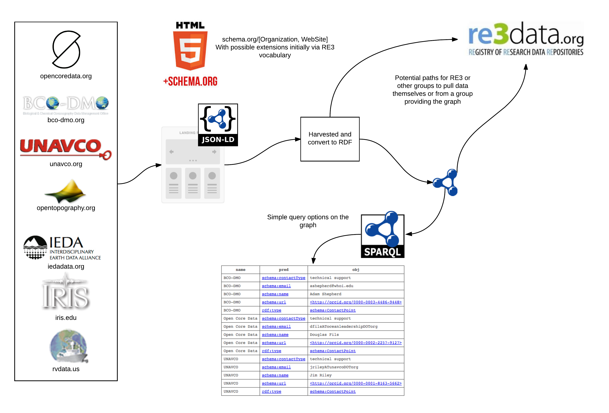

# Review of activity related to harvesting


### About
We are looking to conduct a simple test with a set of providers.  This test will involve
a facility publishing metadata using the approaches defined in the onImplementation.md file 
and elsewhere in this repo.  This metadata will contain general information about the facility 
and links to descriptor documents for the services the facility provides.

Then, using [https://github.com/fils/contextBuilder](https://github.com/fils/contextBuilder) a
set of RDF files (nquads format) will be feed into a triple store and used for basic queries.



## Thoughts
There are several approaches to extracting the triples from the JSON-LD.   In this early
testing we are justing some Go RDF libraries.   However, a group doing this might also be 
interested in using something like the Apache Any23 or other such projects to extract the 
triples.  

### Issues
The biggest issue is the fact that default JSON-LD results in blank nodes in a RDF representation.  
While this is fine in terms of SPARQL where blank nodes are effectively variables it is not so good in a 
LOD approach.  However, through the use of @id in JSON-LD blank nodes can be removed.  This 
make the JSON-LD a bit more involved to author but only by 1 entry per type.  

This potential solution raises a new issue in that by declaring these ID (URIs) we become responsible for them.  
Thus introducing a URI that requires "attention" in a LOD context.  

### Example results
A simple run of this has already been done.  The resulting triples were queried with the following SPARQL which 
was crafted to extract contact point information in this case.  

```
prefix schema: <http://schema.org/>
select ?name ?pred ?obj
where {
  ?s schema:contactPoint ?cpoint .
  ?s schema:name ?name .
  ?cpoint ?pred ?obj
 }
 ```

 and results in


### Visual Graph 
A simple visual of some of the relations in the graph.


